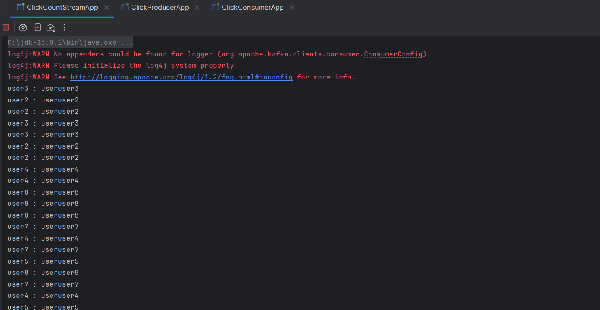
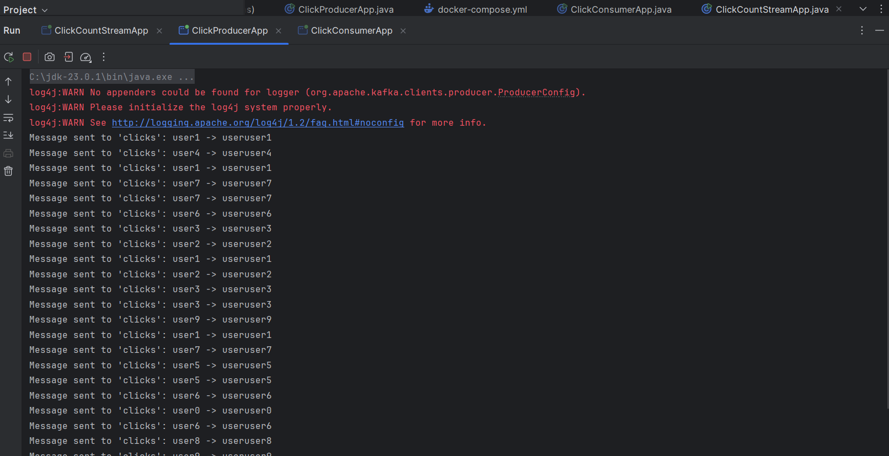
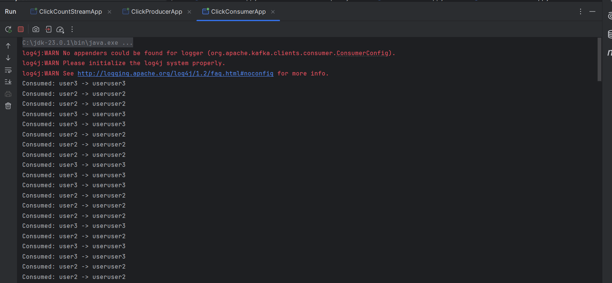
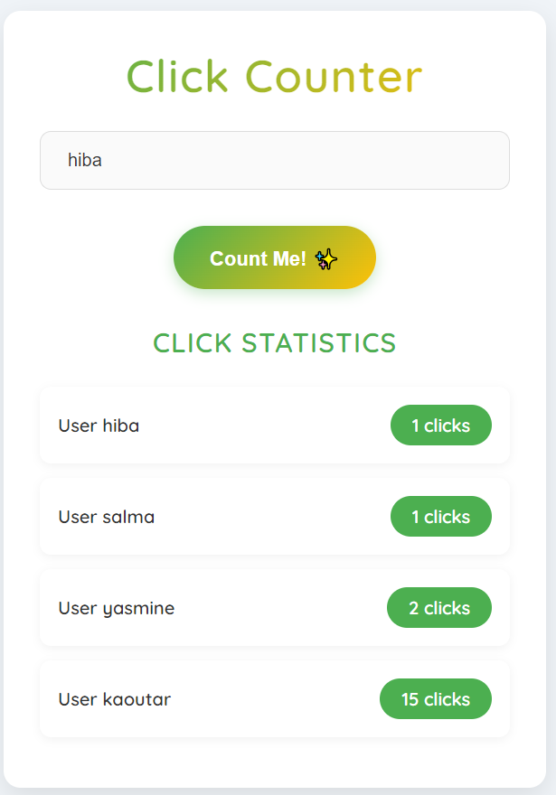

# Click Counter Web Application

## 1. Introduction
The **Click Counter Web Application** is a lightweight tool designed to register user clicks and display statistics in real-time. It uses a **microservices architecture** where communication between services is facilitated by **Apache Kafka**. Additionally, a user-friendly web interface has been integrated to enhance user interaction and display live statistics.

## 2. Architecture Overview

### Frontend (User Interface)
- A responsive web interface built using **HTML**, **CSS**, and **JavaScript**.
- Allows users to register clicks by entering a user ID and clicking a button.
- Displays real-time click count statistics.

### Backend
- A **microservices-based backend** where services communicate using **REST APIs** and **Kafka**.

## 3. Kafka Integration

### 3.1 Message Flow

#### **Click Registration**
1. When a user clicks the button, the frontend sends a request to the backend service.
2. The backend service publishes a "click event" to a Kafka topic (`click-events`).

#### **Processing Click Events**
1. A consumer service subscribes to the `click-events` topic.
2. Upon receiving an event, it increments the click count for the corresponding user and stores the updated data.

#### **Statistics Retrieval**
1. The statistics service retrieves the aggregated click counts.
2. It sends the statistics to the frontend for display.

### 3.2 Kafka Configuration

- **Topics**:
  - `click-events`: Used for publishing and consuming click events.
  
- **Producers**:
  - Backend service acts as a producer to publish click events.
  
- **Consumers**:
  - Statistics service acts as a consumer to process the events and update the click counts.
 
  
  
  
  

## 4. Conclusion
This application demonstrates the use of **Kafka** in a distributed system to handle asynchronous, event-driven communication between microservices. The addition of a user interface improves the overall usability by providing real-time feedback and statistics to users.
